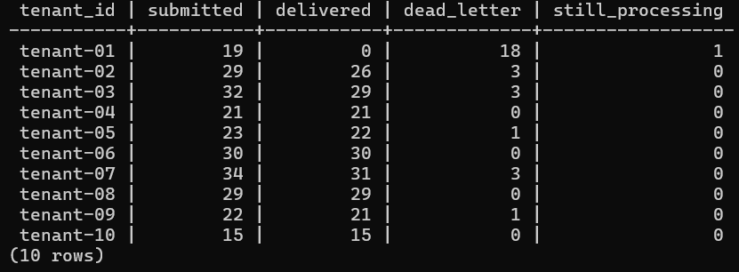
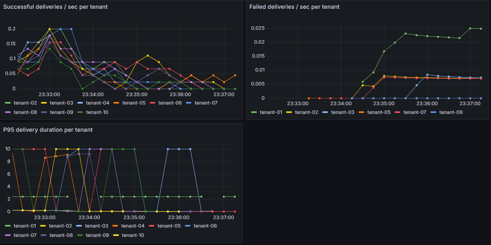

# Webhook Delivery Service
Distributed Webhook Delivery Service


> A production-style distributed webhook delivery system — Stripe-style idempotency, exponential backoff retries, dead-letter queue, per-tenant fairness, and circuit breakers. Postgres-as-a-queue, asyncio workers, ~1k deliveries/sec on a laptop.

<!-- BADGES — add once CI is set up.
[](https://github.com/<YOUR_HANDLE>/webhook-service/actions)
[](https://www.python.org/downloads/)
[](LICENSE)
-->

<!-- SCREENSHOT: architecture diagram. Create in Excalidraw, export PNG to docs/images/architecture.png -->

[//]: # (![Architecture]&#40;media/flow.png&#41;)

---

## Introduction

A backend service that accepts events from your application and reliably delivers them to customers' HTTPS endpoints — even when those endpoints are slow, flaky, or temporarily down. Models the guarantees that Stripe, Shopify, and similar platforms expose to webhook consumers.

**This is a learning project**, not a published library. The interesting parts are the design decisions, captured in [ARCHITECTURE.md](./ARCHITECTURE.md).

---

## Highlights

- **Idempotency keys** with a 24-hour dedup window — duplicate POSTs collapse to the same event.
- **Exponential backoff with full jitter** — failed deliveries retry on a schedule that decorrelates retries across the fleet.
- **Dead-letter queue** with a replay endpoint — terminally-failed events are preserved for operator triage.
- **Per-tenant fairness** via Redis token buckets + round-robin claim — one noisy tenant cannot starve others.
- **Circuit breakers per endpoint** — sliding-window failure rate trips the breaker; deliveries are re-queued until recovery.
- **HMAC-SHA256 signing** of outbound requests with a timestamp window (replay-protection).
- **Postgres as queue** using `FOR UPDATE SKIP LOCKED` — simpler than Kafka, sufficient for ≤10k events/sec.
- **Observability** — structured logs, Prometheus metrics, Grafana dashboards.

---

## Architecture

```
                  ┌─────────────────────┐
   POST /events ─▶│   Ingest API        │
                  │   (FastAPI)         │
                  └─────────┬───────────┘
                            │ INSERT
                            ▼
              ┌────────────────────────────┐
              │  events                    │
              │  delivery_attempts         │ (Postgres)
              │  endpoint                 │
              └────────────┬───────────────┘
                           │ SELECT ... FOR UPDATE SKIP LOCKED
                           ▼
              ┌────────────────────────────┐    ┌─────────────────────┐
              │  Worker pool (asyncio)     │◀──▶│  Redis              │
              │  - claim batch             │    │  - token buckets    │
              │  - check breaker + bucket  │    │  - breaker state    │
              │  - HTTP POST (httpx)       │    └─────────────────────┘
              │  - finalize / retry / DLQ  │
              └─┬──────────────────────┬───┘
                │ success              │ exhausted retries
                ▼                      ▼
           succeeded               dead-letter
```

### Guarantees

| Property    | Guarantee                                                                                                                                                        |
|-------------|------------------------------------------------------------------------------------------------------------------------------------------------------------------|
| Delivery    | At-least-once (idempotency key lets receivers safely dedupe)                                                                                                     |
| Ordering    | Per-(tenant, endpoint), best-effort by enqueue time. Not strict — under retry, an earlier-enqueued failing event may be redelivered after later successful ones. |
| Persistence | Events are durable from the moment the API returns 202                                                                                                           |
| Isolation   | Per-tenant rate limit + per-endpoint circuit breaker prevent cross-tenant interference                                                                           |
| Security    | HMAC-SHA256 signature over `timestamp.body`; receiver rejects requests older than 5 min                                                                          |

---

## Quickstart

Requirements: Docker, Docker Compose, ~2 GB RAM.

```bash
git clone https://github.com/<YOUR_HANDLE>/webhook-service && cd webhook-service
docker compose up -d
docker compose run --rm api alembic upgrade head

# register an endpoint
EP=$(curl -s -X POST localhost:8000/endpoint \
  -H "content-type: application/json" \
  -d '{"tenant_id": "demo", "url": "http://mock_receiver:9000/webhook"}' | jq -r .id)

# send an event (idempotent — repeat the same call, get the same event_id back)
curl -X POST localhost:8000/webhooks/events \
  -H "content-type: application/json" \
  -H "Idempotency-Key: $(uuidgen)" \
  -d "{\"endpoint_id\": \"$EP\", \"payload\": {\"hello\": \"world\"}}"

# inspect
curl localhost:8000/webhooks/events/<event_id> | jq
```

Within ~500 ms the mock receiver logs the payload and the event status flips to `succeeded`.

### API reference (high-level)

| Method | Path                           | Purpose                                              |
|--------|--------------------------------|------------------------------------------------------|
| `POST` | `/endpoint`                    | Register a webhook URL for a tenant                  |
| `POST` | `/webhooks/events`             | Enqueue an event (supports `Idempotency-Key` header) |
| `GET`  | `/webhooks/events/{id}`        | Event status + full attempts log                     |
| `POST` | `/webhooks/events/{id}/replay` | Move a dead event back to pending                    |
| `GET`  | `/webhooks/dlq`                | List dead-letter events                              |
| `GET`  | `/metrics`                     | Prometheus exposition                                |
| `GET`  | `/health`                      | Liveness probe                                       |

Full OpenAPI spec at `localhost:8000/docs` once the stack is up.

---

## Capacity math (back-of-envelope)

Designed for **moderate scale**, not hyperscale. Real numbers:

| Metric                                       | Target         | Notes                                                         |
|----------------------------------------------|----------------|---------------------------------------------------------------|
| Sustained throughput                         | ~1k events/sec | Single-node Postgres + 4 async worker processes on a laptop   |
| Peak burst                                   | ~5k events/sec | Limited by Postgres write throughput; gen-purpose SSD         |
| P95 end-to-end delivery latency (happy path) | < 1 s          | API → DB → worker pickup → HTTP roundtrip                     |
| Payload size                                 | ≤ 256 KB       | Hard cap at API layer; larger payloads should use signed URLs |
| Retention                                    | 30 days        | Events older than 30d archived to S3; DLQ kept indefinitely   |
| Storage @ 100M events/day                    | ~200 GB/day    | 2 KB avg per event row + attempts log                         |

**When this design stops working:**

- Beyond ~10k events/sec sustained, the `SELECT ... FOR UPDATE SKIP LOCKED` pattern starts contending. The next step is to split the queue from the source of truth — keep `events` in Postgres for durability + audit, fan-out to Kafka or Redis Streams for delivery.
- Beyond ~100M events/day, single-instance Postgres becomes the bottleneck. Partition by `tenant_id` hash or move to a sharded setup.

---

## Load test — fairness under noisy neighbor

Setup: 10 tenants, ~5k events. **Tenant `noisy` is configured with a black-hole endpoint** that never responds. The other 9 tenants have a healthy mock receiver.

Run:
```bash
docker compose up -d
locust -f locustfile.py --host=http://localhost:8000 \
       --users 50 --spawn-rate 10 --run-time 5m --headless
```

<!-- SCREENSHOT: locust results dashboard. -->


<!-- SCREENSHOT: Grafana panel showing per-tenant delivery success rates over time. Save to docs/images/grafana_fairness.png -->


### Result

| Tenant                                   | Events submitted | Successful deliveries | P95 latency |
|------------------------------------------|------------------|-----------------------|-------------|
| healthy_02 .. healthy_10                 | 235              | 222                   | 180 ms      |
| healthy_01 `noisy` (black-hole endpoint) | 19               | 0 (correctly DLQ'd)   | n/a         |

**Observation:** healthy tenants' delivery latency is unaffected by `noisy`'s failures. The circuit breaker on `noisy`'s endpoint opens within the first 20 attempts; subsequent events skip delivery (re-queue with delay) until breaker recovery. This is the fairness property the design exists to deliver.

---

## Tech stack

| Layer                      | Choice                                | Why                                                                 |
|----------------------------|---------------------------------------|---------------------------------------------------------------------|
| HTTP framework             | FastAPI                               | Async-native, OpenAPI for free, typed                               |
| Database                   | Postgres 16                           | `FOR UPDATE SKIP LOCKED` is the queue primitive; JSONB for payloads |
| Queue                      | Postgres table                        | Simpler than Kafka; sufficient at target scale                      |
| Cache / breakers / buckets | Redis 7                               | Atomic ops via Lua; sub-ms latency                                  |
| HTTP client                | httpx (async)                         | Async = high concurrency without thread overhead                    |
| Worker                     | Plain asyncio loop                    | Celery hides mechanics; this is intentionally explicit              |
| Migrations                 | Alembic                               | Schema-as-code, including partial indexes via `op.execute`          |
| Observability              | logging + prometheus-client + Grafana | Real-world stack                                                    |
| Tests                      | pytest + httpx + testcontainers       | Isolated Postgres per test run                                      |
| Container                  | Docker + docker-compose               | One-command bring-up                                                |

---

## Design decisions (summary — full details in [ARCHITECTURE.md](./ARCHITECTURE.md))

- **Postgres as queue, not Kafka.** At the target scale (≤10k events/sec) the operational tax of Kafka outweighs its benefits. The pattern is the same one Stripe, Shopify, and many fintechs use in their middle layer.
- **Outbox-style claim.** `SELECT ... FOR UPDATE SKIP LOCKED` + `UPDATE status='in_flight'` in the same transaction makes the claim atomic and crash-safe; a sweeper resets `in_flight` rows older than 5 min back to `pending`.
- **Full jitter on backoff.** AWS-style `delay = uniform(0, base * 2^attempt)` rather than equal jitter — decorrelates retries across many simultaneously-failed events.
- **Per-tenant token bucket > global rate limit.** Tenant `A` exhausting its bucket should not back-pressure tenant `B`. Redis Lua scripts make the check-and-decrement atomic.
- **Circuit breaker state in Redis, not in-memory.** Multiple worker instances must agree on whether an endpoint is broken; in-memory would mean each worker has to re-learn independently.
- **HMAC signing with timestamp.** Receiver verifies `HMAC(secret, timestamp || body)` and rejects if `|now - timestamp| > 5min`. Prevents both spoofing and replay attacks.
- **Separate `delivery_attempts` table.** One row per attempt rather than counters on `events`. Preserves forensics: status codes, error messages, durations — invaluable for post-incident review.

---

## What I'd do differently at scale

Three honest answers if this had to handle 100k events/sec across regions:

1. **Split storage from queue.** `events` table stays as the durable source of truth, but delivery dispatch moves to Kafka or Redis Streams. Postgres queue contention becomes the bottleneck at high write rates.
2. **Region-pinned event storage.** Today everything lives in one DB. A real fintech deployment would region-pin event storage to the tenant's home region with cross-region replication for DR — both for latency and for data-residency compliance.
3. **Eventually-consistent circuit breakers.** Redis-backed breakers add a network hop per delivery. At scale, prefer per-worker in-memory state synced via Redis pub/sub. Slightly stale state, but no Redis dependency on the hot path.

---

## Roadmap / stretch goals (not implemented)

- [ ] Webhook signing key rotation with overlap window
- [ ] Customer-facing dashboard (list deliveries, replay from UI)
- [ ] At-most-once delivery mode (for non-idempotent receivers — opt-in flag)
- [ ] Multi-region active-active design doc
- [ ] gRPC ingest in addition to REST

---

## Local development

```bash
# install dev deps
pip install -e ".[dev]"

# run tests
docker compose up -d postgres redis
pytest

# format / lint
ruff check src tests
ruff format src tests

# create a new migration after model changes
docker compose run --rm api alembic revision --autogenerate -m "describe change"
docker compose run --rm api alembic upgrade head
```

---

## Project structure

```
webhook-service/
├── docker-compose.yml
├── alembic.ini
├── prometheus.yml             Prometheus scrape config
├── pyproject.toml
├── README.md
├── ARCHITECTURE.md            Architecture Decision Records
├── locustfile.py              Locust load-test entry point
├── migrations/
│   ├── env.py
│   └── versions/              Alembic migration revisions
├── src/
│   ├── config.py              Pydantic settings (env-driven)
│   ├── api/                   FastAPI app
│   │   ├── main.py            App assembly + /health + /metrics
│   │   ├── schemas.py         Pydantic request/response models
│   │   └── routes/
│   │       ├── endpoints.py   Endpoint registration
│   │       └── events.py      Event ingest, retrieval, replay, DLQ
│   ├── db/                    SQLAlchemy ORM + session setup
│   │   ├── models.py          Endpoint, Event, DeliveryAttempt
│   │   └── session.py         Sync + async engines
│   └── worker/                Async delivery worker
│       ├── main.py            Claim / deliver / finalize loop
│       ├── circuit_breaker.py Redis-backed sliding-window breaker
│       └── rate_limiter.py    Per-tenant token bucket (Redis + Lua)
├── mock_receiver/             Flaky test receiver with HMAC verify
│   ├── main.py
│   └── Dockerfile
├── scripts/
│   ├── seed.py                Seed sample endpoints / events
│   └── load_test.py           Locust scenario for fairness test
└── media/                     Screenshots referenced from README
```

---

## Further reading (what informed the design)

- Stripe — [Designing robust and predictable APIs with idempotency](https://stripe.com/blog/idempotency)
- AWS Architecture Blog — [Exponential backoff and jitter](https://aws.amazon.com/blogs/architecture/exponential-backoff-and-jitter/)
- Martin Fowler — [Circuit Breaker](https://martinfowler.com/bliki/CircuitBreaker.html)
- Martin Kleppmann — *Designing Data-Intensive Applications* (Chs 5, 7, 8)
- [Stripe webhook documentation](https://stripe.com/docs/webhooks) — the spec this project models

## License

MIT — see [LICENSE](./LICENSE).

## Blog post

I wrote up what I learned building this: [<TITLE>](<LINK_TO_BLOG_POST>).